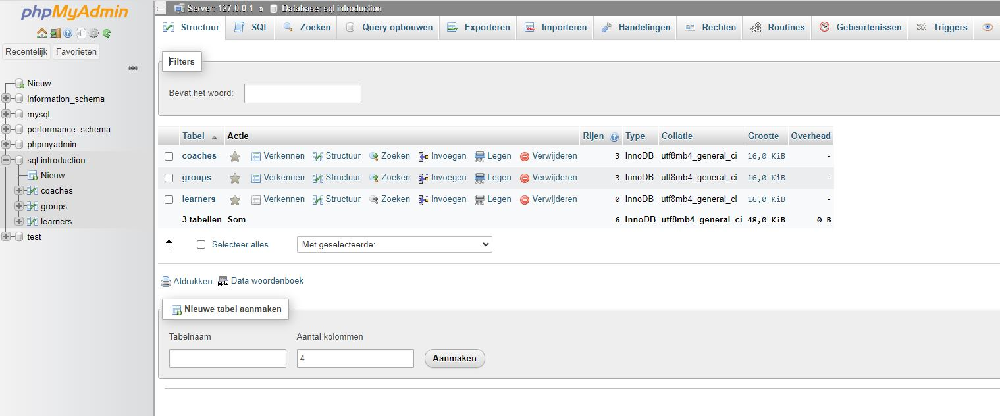
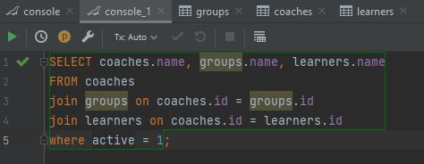

# SQL-introduction

Instructions:

1. Get familiar with [the basics](./SQL-basics.md) and set up a database
- [X] Started up PHPadmin through Xampp and read about some information about SQL and how to use it. 

2. Make the following tables and populate them with some dummy data (have at least two entries for every table)
	- groups: id, name, location, start_date, max_participants
		- [X] First I added the table with the paramaters needed and added 2 dummy data to it. 

	- learners: id, name, email, active
		- [X] Did the same for learners 

    	- coaches: id, name
		- [X] Also for the coaches (see screenshot)

3. Try the following selects:
- Get all data from the groups\*
	- [X] 

- Get the name and email of the first learner, and alias the name to learner_name\* 
	- [X] 

4. 💩 happens - a group needs to be postponed
- Update the start date of the first_group (make it two months later)\*
	- [X] 

- Introduce a new field `status` which can contain a long text indicating the reason for postponing (bonus points if it's a creative one)

5. One of the learners changed his/her mind and decided to be an astronaut
- Delete someone from the learners table\*
	- [X] 

### 🌼 Nice to have (doable)
6. A learner belongs to a group, and a group has a coach
- Find a technique to make this connection in the database (what of the field is unique to a record, so we can refer to it?)

7.We want all the data:
 - Select a coach and all related groups*
 - Select all the above, but also all learners from this group who are still active*
 	- [X] 